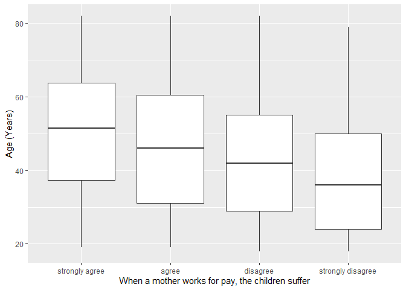
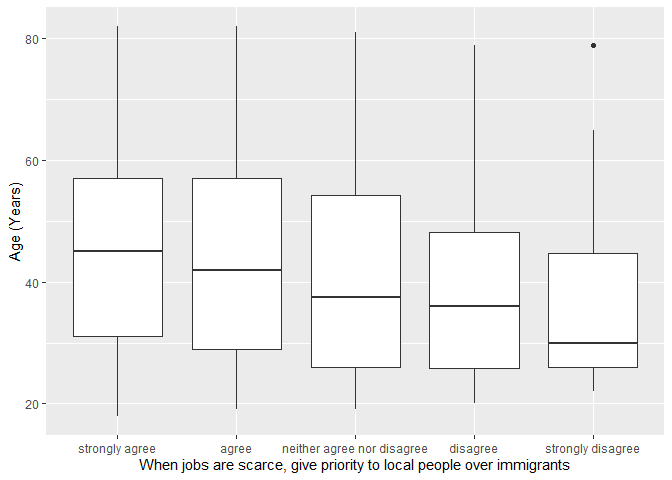

## Introduction

This is the report for the analysis on the [European Value Study (EVS) from 2017](https://search.gesis.org/research_data/ZA7500) which is a survey research program on how Europeans in North Macedonia think about family, work, religion, politics, and society. We are mainly interested in Europeans thoughts on two questions:

1. When a mother works for pay, do Europeans think the children suffer?
2. When jobs are scarce, do Europeans think employers should give priority to local people over immigrants?

## Descriptives of variables

In the following table, the variables are:

1. `v72` represents the first question of interest (1-strongly agree, 2-agree, 3-disagree, or 4-strongly disagree)
2. `v80` represents the second question of interest (1-strongly agree, 2-agree, 3-neither agree nor disagree, 4-disagree, or 5-strongly disagree)
3. `sex` (1-male or 2-female)
4. `age` (years)
5. `education` (1-lower, 2-medium, or 3-higher)

-----------------------------------------------
      v72             v80             age      
--------------- --------------- ---------------
 Min.  :1.000    Min.  :1.000    Min.  :18.00  

 1st Qu.:2.000   1st Qu.:1.000   1st Qu.:35.00 

 Median :3.000   Median :2.000   Median :50.00 

  Mean :2.713     Mean :2.313     Mean :49.57  

 3rd Qu.:3.000   3rd Qu.:3.000   3rd Qu.:64.00 

 Max.  :4.000    Max.  :5.000    Max.  :82.00  
-----------------------------------------------

Table: Descriptive table for continuous variables

Table: Descriptive table for categorical variables

|Education | Sex|     Freq|
|:---------|---:|--------:|
|Lower     |   M|  4727.00|
|Medium    |   M| 11992.00|
|Higher    |   M|  8351.00|
|Lower     |   F|  6802.00|
|Medium    |   F| 13835.00|
|Higher    |   F| 11048.00|

## Graphs

Boxplot for first question of interest (v72)

Boxplot for second question of interest (v80)

## Regression Analysis

### Model: v72 ~ age + $\sqrt{\text{age}}$ + sex + education

-----------------------------------------------------------------------
        &nbsp;          Estimate    Std. Error   t value     Pr(>|t|)  
---------------------- ----------- ------------ ---------- ------------
   **(Intercept)**        2.728      0.09723      28.06     4.655e-172 

       **age**          -0.004774    0.002203     -2.167     0.03023   

    **sqrt(age)**       -0.001149    0.02976     -0.03861     0.9692   

    **sex-female**       0.06448     0.007257     8.886     6.537e-19  

 **education-medium**    0.1233      0.009852     12.51     7.325e-36  

 **education-higher**    0.4012      0.01046      38.36     7.574e-318 
-----------------------------------------------------------------------

---------------------------------------------------------------
 Observations   Residual Std. Error    $R^2$    Adjusted $R^2$ 
-------------- --------------------- --------- ----------------
    56755             0.8576          0.04769      0.04761     
---------------------------------------------------------------

Table: Fitting linear model: v72 ~ age + sqrt(age) + sex + education

The coefficient estimate for `sex` is 0.0644834 which means that the effect of a female respondent compared to a male is positive. The corresponding $p$-value is 6.5368574\times 10^{-19} which is smaller than 0.05. Thus, `sex` is significant in the model.

### Model: v80 ~ age + $\sqrt{\text{age}}$ + sex + education

----------------------------------------------------------------------
        &nbsp;          Estimate    Std. Error   t value    Pr(>|t|)  
---------------------- ----------- ------------ --------- ------------
   **(Intercept)**        2.344       0.1427      16.43    1.646e-60  

       **age**          -0.003823    0.003232    -1.183      0.2369   

    **sqrt(age)**       0.006788     0.04367     0.1554      0.8765   

    **sex-female**      -0.03151     0.01065     -2.959     0.003084  

 **education-medium**   -0.03504     0.01446     -2.424     0.01536   

 **education-higher**    0.4238      0.01535      27.61    9.812e-167 
----------------------------------------------------------------------

---------------------------------------------------------------
 Observations   Residual Std. Error    $R^2$    Adjusted $R^2$ 
-------------- --------------------- --------- ----------------
    56755              1.258          0.03124      0.03115     
---------------------------------------------------------------

Table: Fitting linear model: v80 ~ age + sqrt(age) + sex + education

The coefficient estimate for `sex` is -0.0315131 which means that the effect of a female respondent compared to a male is negative. The corresponding $p$-value is 0.003084 which is smaller than 0.05. Thus, `sex` is significant in the model.

